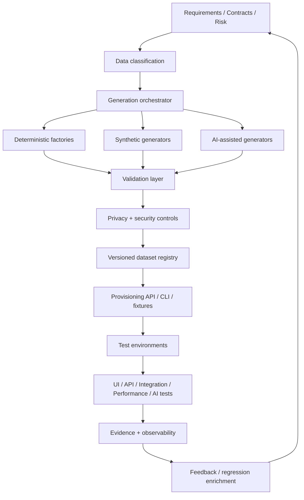

# Test Data Engineering for the AI Era

## Synthetic Data, Privacy, Quality and Agentic Test Automation

**Technical White Paper — Version 1.0**  
**September 2026**

**Author:** Ashok Kumar Manohar  
**GitHub:** [ashokmanohar-ai](https://github.com/ashokmanohar-ai)  
**Publication repository:** [Test Data Engineering Toolkit](https://github.com/ashokmanohar-ai/test-data-engineering-toolkit)

> **Publication note:** This is an independent technical white paper and reference architecture. The associated Test Data Engineering Toolkit repository is currently **Incubating** and should not be interpreted as a completed production implementation of every capability described here. The paper is not a peer-reviewed academic publication, privacy certification, legal opinion, security certification, compliance certification, or statement of production readiness. Production use requires organization-specific privacy, security, data-governance, quality and legal review.

---

## Abstract

Test automation is only as trustworthy as the data that drives it. Modern Quality Engineering depends on test data for UI journeys, APIs, distributed workflows, performance testing, security validation, RAG evaluation, LLM benchmarking and AI-agent trajectories. Yet test data is often managed as an afterthought: copied production records, hand-edited CSV files, shared accounts, brittle fixtures, undocumented seeds or synthetic records that look realistic but violate business rules.

The AI era increases both the value and the risk of test data. Generative models can create large volumes of synthetic examples, derive edge cases, transform schemas and help compose scenario-specific datasets. At the same time, they can reproduce sensitive information, invent invalid relationships, create unrealistic distributions, leak source material, collapse rare classes, or generate examples that appear plausible while failing deterministic business constraints.

This white paper presents **Test Data Engineering for the AI Era** as an evidence-driven Quality Engineering discipline. It proposes a **Classify–Generate–Validate–Protect–Provision–Observe model** in which data sensitivity and purpose are identified before generation, test data is created through deterministic and AI-assisted methods, outputs are validated against schema and business constraints, privacy controls are applied explicitly, datasets are provisioned through governed interfaces, and usage plus quality evidence are retained across the test lifecycle.

The framework distinguishes four important concepts: **synthetic data is not automatically private; realistic data is not necessarily representative; valid data is not necessarily useful; and AI-generated data is not authoritative merely because it looks plausible.** It therefore emphasizes schema-aware generation, referential integrity, seeded reproducibility, boundary and negative cases, distribution coverage, provenance, privacy-risk assessment, deterministic validation, versioning, environment isolation, parallel-safe provisioning, cleanup, quality gates and human review for consequential datasets.

The central proposition is:

> **Test data should be engineered as a governed product: generated from explicit requirements, protected according to sensitivity, validated against deterministic constraints, versioned with provenance, and measured by the defects and risks it helps expose—not by how realistic it merely appears.**

---

## 1. Executive Summary

Enterprise testing needs more than “some sample data.” A single business workflow may require identities with different roles, tenants, valid and invalid account states, orders and payments with referential integrity, boundary values, asynchronous events, high-volume performance records, RAG documents with known relevance relationships, LLM evaluation prompts and reference answers, and agent scenarios with tool state and authorization context.

When these records are created manually or copied from production, privacy, quality and operational risks appear quickly. Test Data Engineering addresses those risks as one system.

A practical lifecycle is:

```text
Test Requirement / Risk / Contract
              ↓
        Data Classification
              ↓
     Generation Strategy
   ┌──────────┼───────────┐
Deterministic | Synthetic | AI-Assisted
   └──────────┼───────────┘
              ↓
 Schema + Business Validation
              ↓
 Privacy + Security Controls
              ↓
 Versioned Dataset / Factory
              ↓
 Environment Provisioning
              ↓
 Test Execution
              ↓
 Cleanup + Evidence + Feedback
```

> **Generation may be probabilistic. Data acceptance must not be.**

---

## 2. Why Test Data Is an Engineering Problem

Test data has schemas, ownership, lifecycle, dependencies, security classifications, transformations, quality rules, distribution characteristics, provisioning interfaces, retention requirements, observability and version history. A mature QE organization therefore treats test data similarly to code and configuration: reviewable, reproducible, governed and measurable.

---

## 3. The AI-Era Data Surface

| Surface | Example data |
|---|---|
| UI/API | users, orders, products, roles, errors |
| Integration | messages, outbox events, dependency responses |
| Performance | large account/product/order populations |
| RAG | documents, chunks, metadata, relevance labels |
| LLM evaluation | prompts, references, expected facts, safety cases |
| Agent evaluation | goals, tool state, permissions, trajectories |
| Security | synthetic canaries, attack strings, tenant boundaries |
| Observability | trace attributes, correlation IDs, sanitized examples |

Each surface needs different fidelity, privacy and reproducibility controls.

---

## 4. The Classify–Generate–Validate–Protect–Provision–Observe Model

**Classify** the purpose, sensitivity, source, environment, consumer and retention requirement. **Generate** using the safest reliable method: deterministic factories, curated fixtures, masked subsets, rule-based synthetic generation, combinatorial generation, AI assistance, or privacy-preserving methods. **Validate** schema, business rules, integrity, uniqueness, distributions and prohibited patterns. **Protect** through minimization, masking, access control, encryption and retention. **Provision** through stable APIs, factories, seeders or dataset packages. **Observe** quality, failures, cleanup, stale data and usage.

---

## 5. Synthetic Data Is Not Automatically Private

Synthetic data can reduce exposure to real personal data, but the word *synthetic* is not a privacy guarantee. NIST SP 800-226 notes that many non-differentially-private synthetic-data techniques provide only informal privacy guarantees and can remain vulnerable to privacy attacks.

For Test Data Engineering this means: do not classify a dataset as safe solely because a generator produced it; record whether real data influenced generation; assess re-identification and memorization risk; avoid preserving rare identifying combinations; and retain provenance about generation methods.

Reference: [NIST SP 800-226](https://doi.org/10.6028/NIST.SP.800-226).

---

## 6. Synthetic Data as a Privacy-Enhancing Technique

The UK Information Commissioner's Office includes synthetic data within its privacy-enhancing-technologies guidance while emphasizing that PET selection depends on the use case and risk. Synthetic data should therefore be one control in a broader privacy architecture, alongside minimization, access control, masking, retention and environment isolation.

Reference: [ICO Privacy-Enhancing Technologies guidance](https://ico.org.uk/for-organisations/uk-gdpr-guidance-and-resources/data-sharing/privacy-enhancing-technologies/).

---

## 7. Data Classification Before Generation

A practical classification model:

| Class | Example | Default treatment |
|---|---|---|
| Public | product catalogue | reusable with validation |
| Internal synthetic | fictional customer | normal test controls |
| Confidential synthetic | security scenarios | restricted access |
| Masked production-derived | transformed business record | privacy review + provenance |
| Personal/sensitive | real customer data | avoid unless explicitly authorized and necessary |

NIST's 2026 draft **Data Classification Practices** guide reinforces the importance of discovering, identifying and labeling data so controls can be applied consistently.

---

## 8. Deterministic Factories and Seeded Reproducibility

Deterministic factories should remain the default when expected structure is known. A reproducible dataset should be reconstructable from:

```text
Generator Version + Schema Version + Seed + Configuration + Reference Rules
```

Recommended evidence includes dataset ID, generator version, random seed, source schema version, rule-set version, privacy classification and review status.

---

## 9. Schema-Aware and Business-Rule-Aware Generation

A generator should understand type, nullability, enums, ranges, regex, uniqueness, foreign keys, dependent fields and conditional rules. OpenAPI, JSON Schema, GraphQL schemas, Pydantic models and database metadata can provide deterministic structure.

Schema-valid data can still be business-invalid. A confirmed order may require successful payment, inventory reservation and authorized customer ownership. Those invariants should be encoded explicitly, not guessed by a model.

---

## 10. Referential Integrity

Related entities should be generated as graphs, not isolated rows:

```text
Tenant
 └── Customer
      └── Order
           ├── OrderItem → Product
           ├── Payment
           └── Events
```

Validation should prove that foreign keys resolve, ownership is consistent, tenant boundaries hold, and events match persisted state.

---

## 11. Positive, Negative and Boundary Data

Positive data should be minimal, explicit, isolated and reproducible. Negative data should violate one meaningful rule at a time where possible. Boundary testing should systematically exercise min−1/min/min+1 and max−1/max/max+1 values, plus empty, Unicode, oversized and malformed string conditions.

---

## 12. Combinatorial and Risk-Based Data

Full Cartesian combinations become expensive. Pairwise or risk-based combination strategies can reduce volume while preserving important interactions. Prioritize authorization, financial state, privacy, critical business transitions and data-integrity combinations.

---

## 13. Distribution-Aware and Rare-Event Data

Realistic-looking records do not guarantee realistic distributions. Performance and analytics testing may require distributions for order size, product popularity, user roles, geography, request types, document lengths and agent tool usage.

Rare high-impact scenarios should often be oversampled deliberately, including cross-tenant access, duplicate payment, stale inventory, poisoned RAG content, long agent trajectories and partial event delivery.

---

## 14. AI-Assisted Data Generation

AI can help generate candidate edge cases, natural-language inputs, paraphrases, adversarial variants, multilingual examples, fictional documents and agent goals. But model output must pass deterministic validation before it becomes accepted test data.

An AI generator should receive a structured contract containing schema, allowed/forbidden values, business rules, privacy constraints, scenario purpose, uniqueness requirements and output labels.

---

## 15. Preventing Hallucinated Test Data

Common AI generation failures include invented enum values, nonexistent foreign keys, impossible dates, fabricated roles, unsupported API fields and contradictory reference answers. Validation should reject unsupported values instead of silently accepting plausibility.

---

## 16. Provenance and Versioning

Every reusable dataset should answer where it came from, whether real data influenced it, which generator/schema/rules created it, who reviewed it, which tests depend on it and when it expires.

Version together:

```text
Dataset + Schema + Generator + Business Rules + Privacy Policy + Expected Labels
```

---

## 17. Data Quality Gates

Example dataset gates:

```text
schema_valid == 100%
referential_integrity == 100%
required_labels == 100%
prohibited_sensitive_patterns == 0
stable_ids == 100%
duplicate_rate <= policy_limit
mandatory_class_coverage == 100%
```

Critical quality failures should not disappear inside an average score.

---

## 18. Duplicate Detection

Detect exact duplicates, normalized duplicates, semantic near-duplicates and repeated intent with superficial wording changes. In AI evaluation, duplicate cases can inflate confidence and reduce real behavioral coverage.

---

## 19. Test Data for APIs and Integration

API data should be generated from authoritative contracts and business rules: request bodies, auth contexts, RBAC combinations, ownership/tenant cases, idempotency keys, dependency outcomes and event payloads.

Distributed integration scenarios additionally need coordinated API, database, dependency and event state with correlation IDs for evidence traceability.

---

## 20. Test Data for UI Automation

Prefer isolated provisioning:

```text
provision user → execute journey → verify state → clean up
```

over shared mutable accounts. UI tests should reference business-level identifiers rather than hard-coded environment records where possible.

---

## 21. Test Data for Performance Engineering

Performance data requires volume, distribution and lifecycle discipline. Consider cardinality, hot/cold data, index selectivity, account reuse, object sizes, cleanup cost and generator throughput. Millions of identical records can produce misleading cache and database behavior.

---

## 22. Test Data for RAG Evaluation

RAG evaluation needs linked knowledge-corpus and query/evaluation datasets. Useful fields include document ID/version, chunk ID, metadata, expected relevant documents, reference answer, expected facts, citation expectations, freshness and authorization context.

Important negatives include no-answer questions, outdated or conflicting documents, lexically similar distractors, poisoned instructions, wrong-tenant content and duplicate chunks.

---

## 23. Test Data for LLM Evaluation

LLM evaluation cases should have stable IDs and explicit expected behavior. Labels should distinguish objective truth from subjective preference. Useful fields include prompt, reference answer, expected facts, forbidden claims, expected behavior and tags.

---

## 24. Test Data for Agent Evaluation

Agent cases require environment state as well as user input: goal, identity, role, tenant, available/prohibited tools, resource state, expected tool sequence, required approval, final state and maximum steps. The oracle should validate trajectory and side effects, not only the final answer.

---

## 25. Security Test Data

Use fictional identities, fake secrets, synthetic account numbers, canaries, cross-tenant identifiers and authorized attack strings. Do not seed real credentials or customer data to make a security test look realistic.

---

## 26. Privacy Testing of the Dataset Itself

The dataset should be tested for email/phone/address patterns, credential-like strings, authorization headers, high-uniqueness quasi-identifiers, rare phrases and unexpected personal names. A scanner is evidence, not proof of anonymity.

---

## 27. Differential Privacy

Differential privacy can provide formal protection for certain statistical and synthetic-data workflows when implemented correctly. It is not a universal requirement and can reduce utility if parameters are poorly chosen. Engineering questions include mechanism, privacy budget, composition, utility impact and independent validation.

Reference: [NIST SP 800-226](https://doi.org/10.6028/NIST.SP.800-226).

---

## 28. Masking, Tokenization and Data Minimization

Masking should preserve only the structure needed for testing. Referential consistency, transformation keys and post-mask validation matter. Minimize before masking: if a test does not need an address, full document or production-derived value, do not include it.

---

## 29. Tenant and Environment Isolation

Multi-tenant data should make tenant ownership explicit and include negative cross-tenant cases. DEV, QA, UAT and performance environments should use namespaces, unique run IDs, temporary stores, ephemeral accounts, cleanup jobs and bounded retention.

---

## 30. Parallel-Safe Data

Each parallel test should own the records it creates. A useful naming convention is:

```text
<run_id>-<worker_id>-<test_id>-<entity_type>
```

Cleanup should be independent and idempotent.

---

## 31. Provisioning Interfaces

A Test Data Platform should expose stable, governed interfaces such as factories, CLIs or APIs rather than requiring direct database edits. Provisioning interfaces should validate authorization, environment scope, quotas and cleanup ownership.

---

## 32. Cleanup as a First-Class Capability

Cleanup should be idempotent, run-scoped, safe after partial failures, auditable and bounded by environment rules. A framework that generates data quickly but cannot remove it safely creates a reliability problem.

---

## 33. Agentic Test Data Automation

AI agents can orchestrate:

```text
Requirement analysis
→ identify data dependencies
→ select factory templates
→ request synthetic variants
→ validate generated records
→ provision environment
→ execute test
→ collect evidence
→ clean up
```

Agents should call governed data services rather than receiving unrestricted database access.

---

## 34. Agent Boundaries

Agents should not be allowed to extract arbitrary production data, bypass classification, disable masking, create unbounded volume, change retention policy, reuse another tenant's data or mark invalid data valid. Tool permissions and quotas must enforce these limits outside the model.

---

## 35. Human-in-the-Loop Controls

Human approval may be appropriate for production-derived data, sensitive classifications, new generators, privacy-control changes, large-volume provisioning, release baselines or disputed AI-generated evaluation labels. Approval should bind to the dataset version and intended use.

---

## 36. Data Observability and Metrics

Useful signals include records generated, generation duration, validation rejection rate, duplicates, privacy findings, provisioning failures, cleanup failures, stale datasets, reuse and generator version.

Example metrics:

\[
SchemaValidity=ValidRecords/GeneratedRecords
\]

\[
IntegrityRate=ValidRelationships/ExpectedRelationships
\]

\[
DuplicateRate=DuplicateRecords/TotalRecords
\]

Metrics must be interpreted according to dataset purpose.

---

## 37. Utility Metrics

A dataset can be private and valid but still useless. Measure branch coverage enabled, defects detected, risk-class coverage, distribution similarity where relevant, retrieval coverage, evaluation discrimination and rerun stability.

The best data is data that improves the quality decision.

---

## 38. Dataset Drift

Datasets become stale when schemas, business rules, production distributions, models, retrieval corpora, tools or permissions change. Dataset maintenance should therefore be continuous engineering.

---

## 39. CI/CD for Test Data

A dataset change can run:

```text
Schema validation
→ deterministic rule checks
→ privacy scan
→ duplicate detection
→ coverage checks
→ provenance validation
→ lightweight consumer tests
→ approval
→ publish versioned dataset
```

Large performance and live-model consumers can run nightly or release profiles.

---

## 40. Data as Release Evidence

If a critical suite depends on invalid or missing data, the correct outcome is not `PASS`. Release evidence should distinguish product failure, test failure, data failure, environment failure and missing evidence.

---

## 41. Production-to-Regression Learning

A safe loop is:

```text
Incident
→ isolate minimal data condition
→ sanitize/synthesize
→ validate privacy
→ add regression case
→ reproduce defect
→ verify fix
→ retain dataset version
```

Production records should not simply be copied into the suite.

---

## 42. Anti-Patterns

Avoid: copying production databases to QA; one shared customer for every test; arbitrary LLM-generated JSON without validation; assuming synthetic means private; unrealistic bulk data; missing seeds/versions; and data generation without cleanup.

---

## 43. Enterprise Adoption Roadmap

**Stage 1:** deterministic factories, seeds, cleanup and schema validation.  
**Stage 2:** classification, masking, provenance and versioning.  
**Stage 3:** boundary, combinatorial and distribution-aware synthetic engineering.  
**Stage 4:** AI-assisted generation with deterministic validation and reviewed labels.  
**Stage 5:** self-service platform with access controls, observability, policy gates and agent integration.

---

## 44. Operating Model

| Concern | Primary owner |
|---|---|
| Data classification | Security / Privacy / Data Governance |
| Business rules | Product + Engineering + QE |
| Generator implementation | QE / Test Data Platform |
| Dataset quality gates | QE |
| Production-derived data approval | Privacy / Security / Data Owner |
| AI generator evaluation | AI QE |
| Environment provisioning | Platform / DevOps |
| Retention | Data Governance |
| Cleanup reliability | QE Platform / Environment Owner |
| Production feedback | QE + SRE + Product |

---

## 45. Suggested KPIs

Track isolated-data coverage, provenance coverage, schema validity, referential-integrity failures, duplicate rate, cleanup success, privacy findings, stale datasets, provisioning time, data-contention flakiness, defects found through generated edge cases and AI-generated-record rejection rate.

---

## 46. Reference Architecture



The architecture deliberately keeps probabilistic generation upstream of deterministic validation and policy enforcement.

---

## 47. Relationship to AI Risk and Data Governance

NIST's AI RMF and Generative AI Profile emphasize lifecycle risk management, measurement and governance. Test datasets influence what behavior is evaluated and therefore what risks can be observed. NIST also notes AI RMF 1.0 is being revised in 2026.

NIST's 2026 Data Governance and Management Profile work seeks to connect privacy, cybersecurity and AI risk-management perspectives around organizational data governance. Test Data Engineering sits directly across those domains.

References:

- [NIST AI Risk Management Framework](https://www.nist.gov/itl/ai-risk-management-framework)
- [NIST Generative AI Profile, NIST AI 600-1](https://doi.org/10.6028/NIST.AI.600-1)
- [NIST Data Governance and Management Profile Working Session](https://www.nist.gov/news-events/events/2026/05/data-governance-and-management-profile-working-session-2)

---

## 48. Reference Repository Status

The associated `test-data-engineering-toolkit` repository is intentionally marked **Incubating**. At publication time its README defines planned scope including schema-aware synthetic generation, deterministic seeded factories, boundary/negative/combinatorial generation, privacy-safe replacement, referential-integrity validation, setup/cleanup, dataset versioning, parallel isolation, performance data preparation, AI/RAG evaluation data preparation and CI/CD validation.

Those are roadmap capabilities, not claims that the toolkit already provides a production-ready implementation.

---

## 49. Limitations

This paper does not provide a universal anonymization method, guarantee that synthetic data cannot leak private information, legal guidance for production-data use, a universal differential-privacy budget, or proof that one synthetic distribution represents every production environment.

---

## 50. Future Research and Engineering

Future work includes schema-to-factory generation, graph-aware referential generation, differential-privacy evaluation tooling, privacy-attack simulation, distribution-drift detection, semantic duplicate detection, AI-generated label calibration, multilingual evaluation data, least-privilege agent provisioning, policy-as-code for data retention and dataset-lineage visualization.

---

## 51. Conclusion

The AI era does not reduce the need for disciplined test data. It makes the discipline more important.

A mature capability treats data as a governed product:

```text
Classify
→ Generate
→ Validate
→ Protect
→ Version
→ Provision
→ Test
→ Observe
→ Learn
```

The goal is not the most realistic-looking dataset. It is the **smallest, safest, most reproducible and most discriminating data needed to expose the risks that matter**.

---

## References

1. NIST, **Guidelines for Evaluating Differential Privacy Guarantees**, SP 800-226, March 2025. https://doi.org/10.6028/NIST.SP.800-226
2. NIST, **Artificial Intelligence Risk Management Framework: Generative Artificial Intelligence Profile**, NIST AI 600-1. https://doi.org/10.6028/NIST.AI.600-1
3. NIST, **AI Risk Management Framework**. https://www.nist.gov/itl/ai-risk-management-framework
4. NIST, **Data Classification Practices: SP 1800-39 Initial Public Draft**, February 2026. https://csrc.nist.gov/news/2026/sp-1800-39-ipd-data-classification-practices
5. NIST, **Data Governance and Management Profile Working Session 2**, May 2026. https://www.nist.gov/news-events/events/2026/05/data-governance-and-management-profile-working-session-2
6. UK Information Commissioner's Office, **Privacy-Enhancing Technologies**. https://ico.org.uk/for-organisations/uk-gdpr-guidance-and-resources/data-sharing/privacy-enhancing-technologies/

---

## Citation

Formal citation metadata is provided alongside this publication.

## License

This publication is distributed under the repository's MIT License unless otherwise stated.